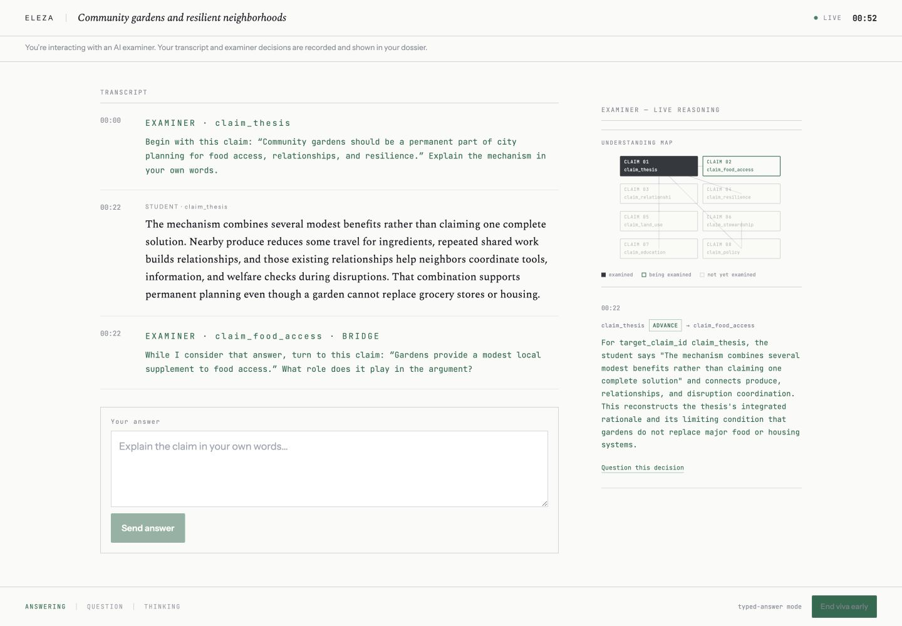
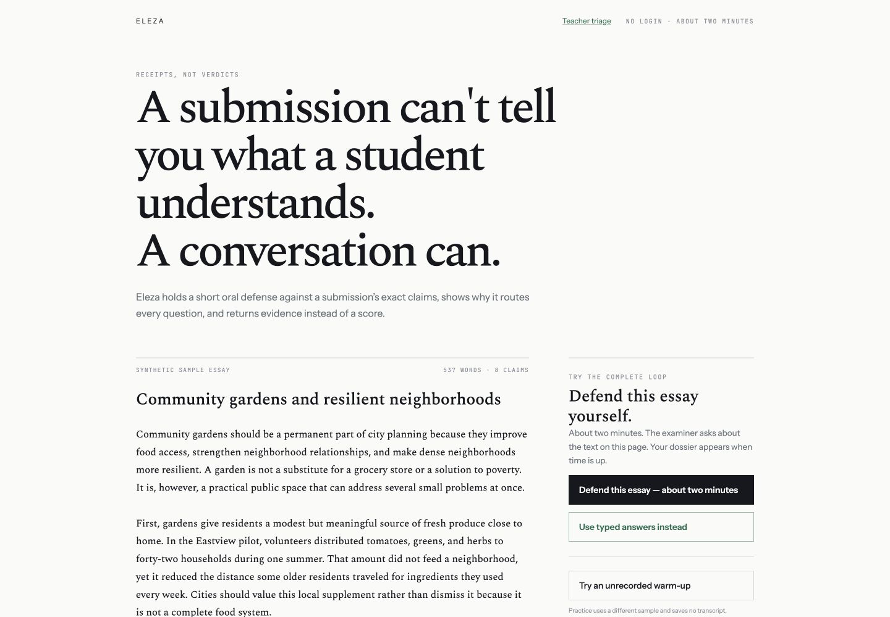
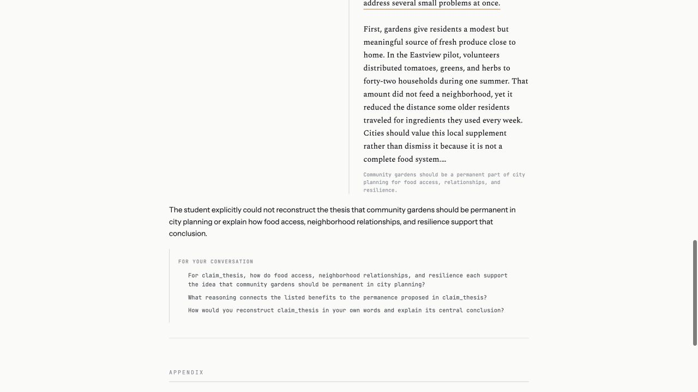

# Eleza

A submission can't tell you what a student understands. A conversation can. Eleza is a transparent oral-defense tool for submitted work: it parses an essay, program, lab report, or case analysis into exact source spans, conducts an examiner-routed viva, and returns a dossier of transcript-to-document receipts. It does not produce authenticity scores, pass/fail labels, or verdicts.

Eleza improves on existing oral-assessment concepts rather than claiming to create the category. Research deployments and commercial tools already generate viva questions from student submissions, but their evaluation is generally hidden and returned as grades or flags. Eleza instead targets a structured graph of the specific document, renders the examiner's routing rationale live, and returns span-linked evidence for a teacher to adjudicate. The engine is also domain-parameterized: profiles define node vocabulary, edge semantics, and probe framing, while the invariants, divergence types, and gates stay universal across essay, code, lab-report, and case-analysis defenses.

**Hosted judge demo:** [https://eleza-drab.vercel.app](https://eleza-drab.vercel.app)



## What judges can test

This is a literal ten-minute route through the zero-login demo. Real vivas are teacher-configurable at 5–8 minutes; the hosted demo lasts about two minutes as a public-cost control.

1. Open the [hosted demo](https://eleza-drab.vercel.app). The landing page presents four synthetic domain cards—Essay, Code, Lab report, and Case analysis—plus the essay fixture's complete-loop controls.

   

2. Select **Defend this essay — about two minutes**, grant microphone access, answer aloud, and press **Finish answer** when the response is complete. The voice model speaks the externally routed questions; the separate examiner chooses each route. If voice is unsuitable, restart with **Use typed answers instead**: typed responses use the same examiner, decision log, divergence analysis, and dossier path.
3. Watch the transcript, routing rationale, and understanding map update together. The map is coverage derived from the append-only decision log: **examined / being examined / not yet examined**, never a score.
4. Select **Question this decision** under a rationale. The three-turn meta-viva must cite the target node and the existing rationale; a question outside those supplied records receives a plain limitation instead of an invented answer.
5. End the viva or let its timer finish. The generated dossier shows defended nodes and only three possible finding types: `cannot_reconstruct`, `mechanism_gap`, and `inconsistency`. Each finding links a transcript timestamp and excerpt to an exact document span and includes neutral prompts under **For your conversation**.

   

6. Copy the unguessable student dossier link and open it in a private window; it renders the same evidence document the teacher sees. Select **Print dossier** to inspect the A4 layout, generation footer, findings, transcript appendix, and decision-log appendix.
7. Return to the landing page and open the other fixture cards. Code questions target design decisions and failure modes; lab questions test result-to-interpretation discipline; case questions stress the assumptions carrying a recommendation. Each card offers the same voice and typed paths through one shared allowance.
8. Try **Defend your own writing** with 250–1,200 words of argumentative prose. Confirm its generated graph, then start a viva whose questions and dossier spans refer to that text. Text with fewer than four claim nodes is stopped before session creation. **Try an unrecorded warm-up** uses a second essay and persists no transcript, decisions, or dossier.
9. Open [`/inspect`](https://eleza-drab.vercel.app/inspect) to upload `.txt` or `.pdf`, inspect the document-first graph, click nodes to underline exact spans, and follow dependency lines. Open [`/triage`](https://eleza-drab.vercel.app/triage) to see completed vivas sorted by finding count, with profile and finding types shown inline; nonzero counts deep-link to the first dossier finding.
10. If the organizer supplied a judge access code, enter it in the optional landing field. A matching server-side code selects a separate judge-capacity tier without publishing or exposing the value; the same session duration and evidence rules still apply.

Public session creation is limited to five sessions per salted IP digest per UTC day, so judges sharing one network should use the demo deliberately.

## Architecture

Eleza is three connected systems:

1. **Claim graph engine:** server-side `.txt` and `.pdf` extraction followed by profile-structured graph generation. Every profile restricts the model to its node and edge vocabulary, and every node must resolve to real character offsets in the submitted artifact.
2. **Live viva:** the Realtime voice model speaks while a separate GPT-5.6 examiner evaluates each completed answer and chooses `probe`, `branch`, or `advance`. A pre-fetched bridge question covers examiner latency without handing routing authority to the voice model.
3. **Post-viva divergence analysis:** the transcript is compared with graph-owned document spans for only `cannot_reconstruct`, `mechanism_gap`, or `inconsistency`. The dossier links each finding's timestamp, answer excerpt, node, and exact document span.

### Domain profiles

The graph and examiner engines are domain-parameterized. A profile defines node vocabulary, edge semantics, probe framing, dossier wording, and its deterministic fixture. The exact-span validator, routing rules, rationale gate, append-only decision log, three divergence types, understanding map, meta-viva limits, rate budget, and dossier receipts are universal.

| Profile | Nodes | Edges | Probe emphasis | Fixture acceptance weak spot |
|---|---|---|---|---|
| [Essay](./profiles/essay.ts) | `claim`, `evidence`, `citation` | `supports`, `rebuts`, `depends_on` | Reconstruct the claim, evidence, mechanism, and dependency | [`community-gardens-argument.txt`](./fixtures/community-gardens-argument.txt): paragraph three's shared-work-to-relationships mechanism; [`weak-viva.json`](./fixtures/divergence/weak-viva.json) cannot reconstruct it |
| [Code](./profiles/code.ts) | `design_decision`, `implementation`, `assumption` | `depends_on`, `constrains`, `alternative_to` | Justification, failure modes, and rejected alternatives | [`code-inventory-tracker.py`](./fixtures/code-inventory-tracker.py): a name-keyed dictionary silently replaces a different SKU with the same display name |
| [Lab report](./profiles/lab-report.ts) | `hypothesis`, `method_choice`, `interpretation`, `conclusion` | `supports`, `tests`, `depends_on` | Result-to-interpretation discipline, falsification, and controls | [`lab-photosynthesis-report.txt`](./fixtures/lab-photosynthesis-report.txt): one distance-and-bubble-count result is overextended into a universal sole-factor conclusion |
| [Case analysis](./profiles/case-analysis.ts) | `recommendation`, `assumption`, `tradeoff`, `rejected_alternative` | `supports`, `undermines`, `depends_on` | Stress the assumption that carries the recommendation | [`case-expansion-memo.txt`](./fixtures/case-expansion-memo.txt): a three-afternoon schedule silently depends on spare volunteer capacity the memo never supports |

[`fixtures/README.md`](./fixtures/README.md) records the exact node and expected scripted receipt for each weak spot.

### Five invariants

- **The voice model talks; the examiner decides.** The Realtime session never chooses its own next question.
- **One decision log.** Every examiner decision is an append-only entry rendered by both the live pane and dossier.
- **The rationale gate is schema-level.** A rationale is rejected unless it cites the target node ID and quotes an exact transcript substring of at least five words or 25 contiguous characters.
- **Divergence is content-reconstruction only.** Written-versus-spoken register comparison is excluded for bias reasons.
- **No verdicts.** Eleza presents evidence, never an authenticity score, percentage, pass/fail label, or “likely AI” output. Humans decide.

What Eleza deliberately does not do: issue verdicts, compare written and spoken register, or retain audio recordings. Timestamped transcripts preserve the evidentiary receipt without biometric voice residue or surveillance-weight storage.

## Building with Codex

This repository was built in one primary Codex collaboration. The append-only [build log](./BUILD_LOG.md) preserves every user prompt and the consequential choices or outcomes after it; Git preserves each working checkpoint.

### What Codex built

| Slice | Delivered behavior | Main commits |
|---|---|---|
| Claim graph | Text/PDF upload, server extraction, GPT structured graph generation, span validation, Supabase persistence, and document-first inspection | `514d53c`, `cbb3df1` |
| Live viva | Realtime question delivery, timestamped transcript, pure examiner, rationale gate, bridge pipeline, append-only decisions, and live reasoning pane | `801546c`, `b725804`, `ebf8e52`, `2c20ab8` |
| Dossier | Three-type divergence analysis, semantic receipt validation, persisted dossiers, timestamp-to-document links, and evidence appendices | `c4fcfba`, `fa24e8d` |
| Judge flow | Zero-login demo, unrecorded practice, typed fallback, teacher triage, rate limits, and Vercel deployment | `4253a2a`, `09c9243` |
| Voice hardening | Minimum-lifetime client tokens, explicit answer commits, Safari-safe playback, and peer/ICE diagnostics | `347870e`, `340857a` |
| Participant controls | Paste-your-own essay, honest graph-control surface, A4 dossier printing, and signed student links | `f425e1e`, `01c40b3` |
| Feature freeze | Stronger rationale receipts, judge tier, meta-viva, understanding map, teacher follow-ups, and audio-retention boundary | `d1aadd3` |
| Domain profiles | Essay profile extraction, code defense, lab and case profiles, four-card landing, and profile-aware dossiers; current essay prompt bytes are pinned after a non-semantic metadata-header diff | `2c5cfd3`, `7019843`, `0b691e0` |
| Production receipts | Four-domain deployment and live migration verification | `59e26ca`, `4202970` |

The chronological commit receipt through the latest verified production state is:

| Commit | What changed |
|---|---|
| `514d53c` | Added claim-graph upload and inspection |
| `cbb3df1` | Verified deterministic extraction and span receipts |
| `801546c` | Built the Realtime viva and examiner loop |
| `b725804` | Wired examiner decisions into the live voice pipeline |
| `ebf8e52` | Added the real-provider viva acceptance harness |
| `1c457f4` | Established the Codex build log |
| `213d2b0` | Recorded the manual handoff requirements |
| `3143df9` | Documented the Supabase migration dependency |
| `2c20ab8` | Enforced exact Realtime question delivery |
| `c4fcfba` | Built post-viva divergence dossiers |
| `fa24e8d` | Recorded stored dossier acceptance |
| `4253a2a` | Built the zero-login judge demo |
| `09c9243` | Hardened the demo for production |
| `347870e` | Verified minimum-lifetime Realtime tokens |
| `340857a` | Added explicit voice turn completion |
| `365c785` | Harvested the initial Codex build narrative |
| `12f7c22` | Completed the submission-readiness pass |
| `f425e1e` | Added pasted defenses, dossier printing, and student links |
| `01c40b3` | Recorded participant-flow production acceptance |
| `d1aadd3` | Completed the final feature-freeze implementation |
| `2c5cfd3` | Extracted the essay domain profile; later metadata-only template headers were diffed as non-semantic and pinned at their current bytes |
| `7019843` | Added the code defense profile |
| `0b691e0` | Added lab-report and case-analysis profiles |
| `59e26ca` | Recorded four-domain production verification |
| `4202970` | Verified migrations 005 and 006 in the live database |

### Decision receipts

Every current non-obvious `// DECISION:` comment is reflected here:

| Source | Decision and reason |
|---|---|
| [`src/lib/generate-claim-graph.ts`](./src/lib/generate-claim-graph.ts) | Preserve a deterministic local graph path so the curated judge demo remains inspectable without credentials. |
| [`src/lib/generate-claim-graph.ts`](./src/lib/generate-claim-graph.ts) | Give a profile-invalid graph the same single bounded re-extraction as an under-granular graph. |
| [`src/lib/claim-graph.ts`](./src/lib/claim-graph.ts) | Let shared persistence parse the vocabulary union while locking every model and session boundary to one profile-specific schema. |
| [`src/lib/examiner.ts`](./src/lib/examiner.ts) | Keep the rendered profile prompt and graph as a byte-identical cached prefix within each viva; only the latest answer is fresh input. |
| [`src/lib/viva-pipeline.ts`](./src/lib/viva-pipeline.ts) | Precompute deterministic bridge questions so latency never grants routing authority to the voice model. |
| [`src/app/api/viva/turn/route.ts`](./src/app/api/viva/turn/route.ts) | Persist an accepted examiner decision before exposing it to the UI, preventing parallel reasoning state. |
| [`src/lib/divergence.ts`](./src/lib/divergence.ts) | Send source evidence once and return compact classifications; transcript and decision records remain canonical. |
| [`src/lib/dossier-store.ts`](./src/lib/dossier-store.ts) | Ignore duplicate sequence receipts so a failed dossier request can be retried without rewriting transcript history. |
| [`src/lib/dossier-store.ts`](./src/lib/dossier-store.ts) | Retain timestamped transcripts but no viva audio, preserving evidence without biometric residue. |
| [`src/lib/rate-limit.ts`](./src/lib/rate-limit.ts) | Store only a service-key-salted IP digest; raw visitor IP addresses never enter Postgres. |
| [`src/app/api/realtime/token/route.ts`](./src/app/api/realtime/token/route.ts) | Request OpenAI's supported 10-second client-token minimum instead of accepting the longer default. |
| [`src/app/api/realtime/token/route.ts`](./src/app/api/realtime/token/route.ts) | Disable VAD so thoughtful pauses are preserved and one explicit student action defines each examiner answer. |
| [`src/app/viva/page.tsx`](./src/app/viva/page.tsx) | Make **Finish answer**, not a pause detector, the answer boundary. |
| [`src/app/viva/page.tsx`](./src/app/viva/page.tsx) | Deliver one externally routed question with empty model input so the voice layer cannot freelance. |
| [`src/app/viva/page.tsx`](./src/app/viva/page.tsx) | Handle Safari track events with a fallback `MediaStream` and explicit audio playback. |
| [`src/app/viva/page.tsx`](./src/app/viva/page.tsx) | Exchange SDP directly from the browser using an ephemeral token; audio never crosses the app server. |
| [`src/app/viva/code-source-panel.tsx`](./src/app/viva/code-source-panel.tsx) | Derive code-to-reasoning leader geometry from source-span and decision-log DOM receipts rather than storing parallel routing state. |
| [`src/lib/student-dossier-token.ts`](./src/lib/student-dossier-token.ts) | Sign the existing dossier ID instead of persisting a second access record, keeping evidence canonical while making the participant route unguessable. |
| [`src/lib/meta-viva.ts`](./src/lib/meta-viva.ts) | Replace any ungrounded meta-viva output with a record-limited statement instead of retrying into confabulation. |

### Where the working rules changed or constrained the implementation

The human-set architecture boundaries were concrete: the voice model could speak but not route; one decision log had to feed both live and dossier views; divergence stayed content-only; and no surface could produce a verdict. The supplied [design references](./design) set typography, spacing, ink, and exhibit treatment, while verified behavior and the five invariants took precedence over static specimen content.

The rationale gate began with a permissive two-character transcript match. The feature-freeze pass strengthened it to an exact substring of at least five words or 25 contiguous characters, applied to initial output and retries; tests reject a two-character quote and a right-words/wrong-order paraphrase while accepting the exact 25-character boundary.

Audio retention was considered and declined. Hearing a student's hesitation did not justify storing biometric voice data; timestamped transcripts carry the needed evidence without surveillance-weight infrastructure. Migrations, dashboard secrets, and production credentials also remained human-controlled operations.

Two integration-discipline outcomes followed directly from those rules. Mockup marginalia whose wording implied external citation verification was not reproduced because it exceeded the content-reconstruction scope, and the instructions explicitly made invariants authoritative over mockups. A locally verified profile commit was not deployed while the target environment lacked its required migrations; deployment resumed after the schema was confirmed.

### How GPT-5.6 is used in the three systems

Model routing is centralized in [`src/lib/models.ts`](./src/lib/models.ts); Luna is deliberately unused.

| System | Model | Use |
|---|---|---|
| Claim graph engine | `gpt-5.6-sol` | Runs once per submission with [`prompts/claim-graph.md`](./prompts/claim-graph.md) plus the selected profile vocabulary. Strict structured output produces only that profile's node and edge types; Zod validates IDs, vocabulary, and real character spans before persistence. |
| Live viva examiner | `gpt-5.6-terra`, with `gpt-5.6-sol` for gate retry | Receives a stable profile prompt-plus-graph prefix and the latest completed answer as a fresh suffix. It emits a structured routing decision. Zod rejects rationales without the target ID and an exact qualifying transcript quote, plus invalid `probe`/`branch`/`advance` routes. Terra also powers the ephemeral [`prompts/meta-viva.md`](./prompts/meta-viva.md) exchange; `gpt-realtime-2.1` only voices the routed question. |
| Post-viva divergence | `gpt-5.6-sol` | Uses [`prompts/divergence.md`](./prompts/divergence.md) to return only the three allowed content-reconstruction receipts. Semantic validation rejects invented timestamps, excerpts, node IDs, or spans. A second Sol call using [`prompts/follow-up.md`](./prompts/follow-up.md) produces node-linked prompts for the teacher's later conversation. |

## Local setup

Requirements:

- Node.js 20 or newer
- An OpenAI API key with access to the configured models
- A Supabase project

```bash
git clone https://github.com/Jeremiah-Sakuda/Eleza.git
cd Eleza
npm install
cp .env.example .env.local
```

Apply every SQL file in [`supabase/migrations`](./supabase/migrations) in filename order using the Supabase SQL Editor:

1. [`001_claim_graphs.sql`](./supabase/migrations/001_claim_graphs.sql)
2. [`002_live_viva.sql`](./supabase/migrations/002_live_viva.sql)
3. [`003_dossiers.sql`](./supabase/migrations/003_dossiers.sql)
4. [`004_demo_rate_limits.sql`](./supabase/migrations/004_demo_rate_limits.sql)
5. [`005_judge_access.sql`](./supabase/migrations/005_judge_access.sql)
6. [`006_domain_profiles.sql`](./supabase/migrations/006_domain_profiles.sql)

Then start the app:

```bash
npm run dev
```

Open [http://localhost:3000](http://localhost:3000). Use `/inspect` for upload and graph inspection, enter `/viva` through a generated handoff, and use `/triage` for completed dossiers.

## Environment variables

Copy [`.env.example`](./.env.example) to `.env.local`. `.env.local` is gitignored.

| Variable | Required | Exposure | Purpose |
|---|---:|---|---|
| `OPENAI_API_KEY` | Yes | Server only | Responses API calls and ephemeral Realtime client tokens. Never prefix it with `NEXT_PUBLIC_`. |
| `NEXT_PUBLIC_SUPABASE_URL` | Yes | Public configuration | Identifies the Supabase project. |
| `SUPABASE_SERVICE_ROLE_KEY` | Yes | Server only | Persistence, RPC rate limiting, health checks, and the privacy-preserving IP-hash salt. |
| `DEMO_GLOBAL_DAILY_CAP` | No | Server configuration | Global daily session/token capacity; defaults to `200`. |
| `JUDGE_ACCESS_CODE` | No | Server only | Selects the judge-only capacity tier when a matching code is supplied. Never prefix it with `NEXT_PUBLIC_`. |
| `JUDGE_DAILY_CAP` | No | Server configuration | Separate daily capacity for valid judge-code requests; defaults to `50`. |

```dotenv
OPENAI_API_KEY=...
NEXT_PUBLIC_SUPABASE_URL=...
SUPABASE_SERVICE_ROLE_KEY=...
DEMO_GLOBAL_DAILY_CAP=200
JUDGE_ACCESS_CODE=...
JUDGE_DAILY_CAP=50
```

## Sample data

All repository samples are synthetic; no real student work or institution names are used.

- [`fixtures/community-gardens-argument.txt`](./fixtures/community-gardens-argument.txt): 537-word argumentative judge essay with a deterministic eight-claim graph.
- [`fixtures/practice-transit-argument.txt`](./fixtures/practice-transit-argument.txt): separate unrecorded warm-up essay.
- [`fixtures/code-inventory-tracker.py`](./fixtures/code-inventory-tracker.py): introductory Python inventory assignment with the documented duplicate-name/SKU collision.
- [`fixtures/lab-photosynthesis-report.txt`](./fixtures/lab-photosynthesis-report.txt): lab report with the documented sole-factor overreach.
- [`fixtures/case-expansion-memo.txt`](./fixtures/case-expansion-memo.txt): case memo with the documented spare-volunteer assumption.
- [`fixtures/examiner`](./fixtures/examiner): five canned answers—strong, restated conclusion, contradictory, evasive, and off-topic—for examiner gate and routing tests.
- [`fixtures/divergence`](./fixtures/divergence): scripted weak defenses for all four domain fixtures.
- [`fixtures/viva-answers.json`](./fixtures/viva-answers.json): deterministic answers for wired-viva acceptance runs.

## Testing

The offline verification path is safe for a fresh clone after `npm install`:

```bash
npm test
npm run lint
npm run build
npm run verify:client-secrets
```

- `npm test` runs the Node test suite across examiner gates, all four profiles, exact spans, deterministic vivas, scripted weak defenses, meta-viva limits, understanding-map state, dossier receipts, rate helpers, and Realtime turn control.
- `npm run lint` runs TypeScript without emitting files.
- `npm run build` performs the production Next.js build.
- `npm run verify:client-secrets` scans built browser assets for configured server secret values.

With valid `.env.local` credentials and all migrations applied, provider-backed acceptance is available:

```bash
npm run verify:viva
npm run verify:dossier
npm run verify:dossier:stored
npm run verify:rate-limit
npm run verify:realtime-token
```

To exercise the upload endpoint twice against the essay fixture, keep `npm run dev` running in another terminal and run:

```bash
npm run verify:fixture
```

That command checks extraction, at least six claim nodes, real spans, and repeat structure through the HTTP route. Provider-backed viva, stored-dossier, rate-limit, and token checks create test records in the configured Supabase project; use a development project when reproducing them.

## Production deployment on Vercel

1. Create a Supabase project and apply all six migrations above in order.
2. Import or link the repository in Vercel.
3. Add the environment variables above to Production; add them to Preview and Development if those deployments should be functional. Mark the OpenAI key, service-role key, and judge access code sensitive.
4. Set an OpenAI project spend cap appropriate for the public demo.
5. Deploy, then verify:

   ```bash
   curl -i https://YOUR_DOMAIN/api/health
   ```

The browser obtains a rate-authorized, short-lived client token from `/api/realtime/token`, then exchanges WebRTC SDP and audio directly with OpenAI. The standard OpenAI key never enters a client response or bundle. Session and token creation are atomically limited in Supabase to five attempts per salted IP digest per UTC day and a configurable global daily cap. Judge-demo sessions have a 150-second server-side hard ceiling in Postgres and are checked again before examiner turns.

When `JUDGE_ACCESS_CODE` is configured, a judge may enter it on the landing page or supply it as the `judge_code` query parameter. A matching code bypasses the per-IP tier but remains atomically constrained by `JUDGE_DAILY_CAP`; its value stays server-only and out of documentation and client assets.

[`vercel.json`](./vercel.json) registers a daily `/api/health` cron that performs a trivial Supabase read. Production acceptance should include a `200` health response, Chrome and Safari microphone permission on HTTPS, one desktop and one physical phone, a complete voice viva, a complete typed viva, and confirmation that attempt six from one connection receives HTTP `429` with the next UTC retry time.

## License

Eleza is licensed under the [PolyForm Noncommercial License 1.0.0](./LICENSE): you may view, run, and modify it for noncommercial use, while commercial use is reserved.

For the OpenAI Build Week hackathon, the Sponsor, Administrator, and Judges may test, evaluate, and use the project free through the judging period under the evaluation notice appended to the license.
